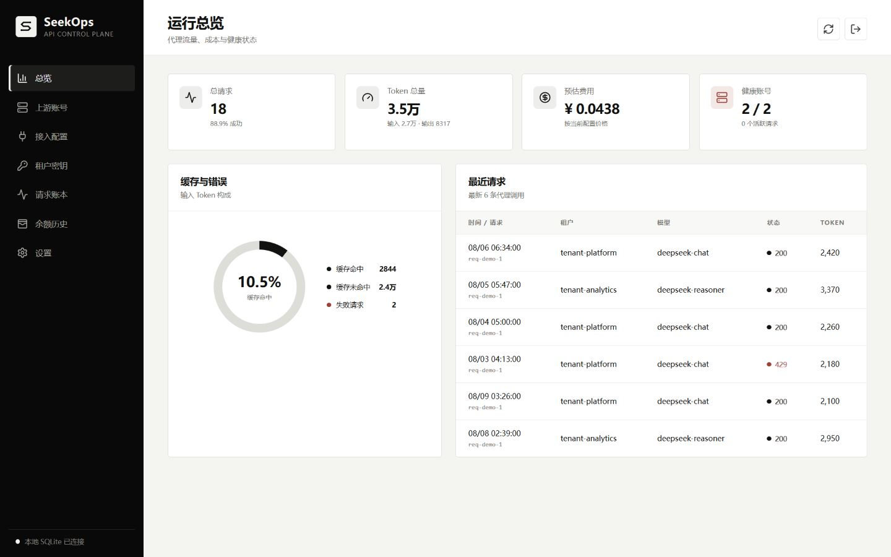
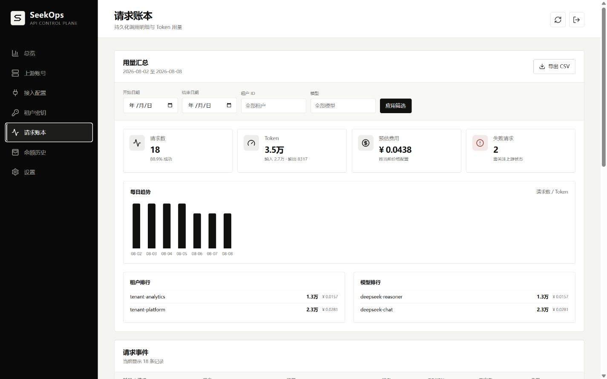
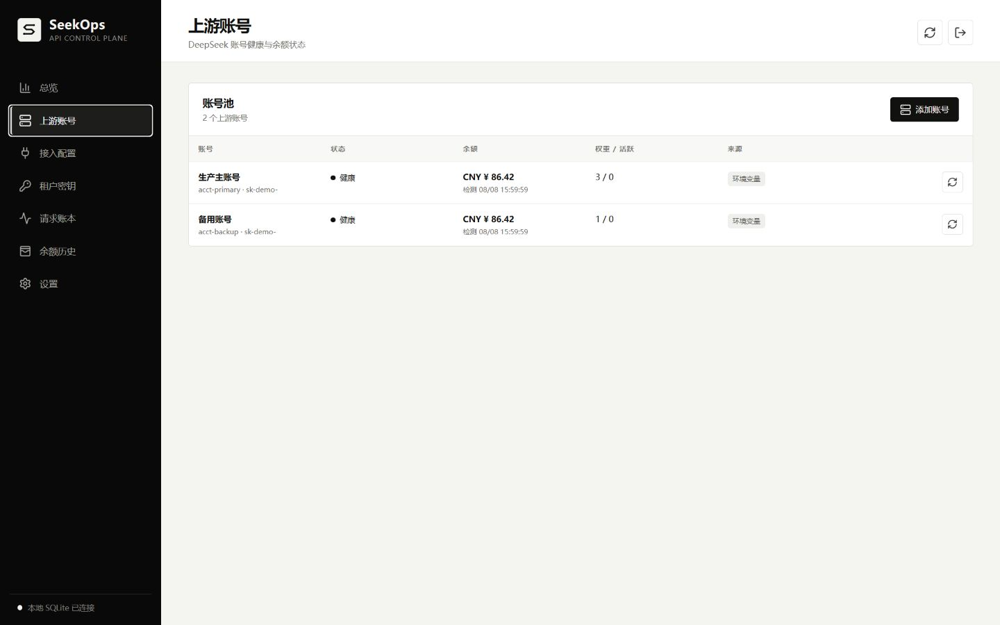

# DeepSeek Proxy

[](LICENSE)

DeepSeek API 兼容代理的本地控制平台。它接受平台虚拟 API Key，按上游账号池选择凭据，转发 OpenAI 兼容请求，并从响应中的 `usage` 字段建立持久化用量账本和可处理告警。

本地运行默认使用 `data/seekops.db` 持久化，不需要单独部署数据库或 Redis。测试代码在未传入 DB 时仍会使用内存存储；生产环境还需要接入密钥管理服务。

## 控制台预览

以下截图使用匿名演示数据，展示从代理池健康、请求用量到成本分析的核心工作流。

<p>
  
  
</p>
<p align="center">
  
</p>

## 快速开始

PowerShell:

```powershell
$env:UPSTREAM_API_KEY = "sk-your-deepseek-key"
$env:PLATFORM_API_KEY = "proxy-demo-key"
go run ./cmd/proxy
```

打开 `http://localhost:8080/console/` 完成本地初始化和上游账号配置。客户端把 `proxy-demo-key` 作为 Bearer Token，并将 OpenAI 兼容 Base URL 指向 `http://localhost:8080/v1`：

```powershell
curl http://localhost:8080/v1/chat/completions `
  -H "Authorization: Bearer proxy-demo-key" `
  -H "Content-Type: application/json" `
  -d '{"model":"deepseek-chat","messages":[{"role":"user","content":"Hello"}],"stream":false}'
```

Anthropic SDK 兼容 Base URL 为 `http://localhost:8080/anthropic`，使用同一个平台 Key：

```powershell
curl http://localhost:8080/anthropic/v1/messages `
  -H "x-api-key: proxy-demo-key" `
  -H "anthropic-version: 2023-06-01" `
  -H "Content-Type: application/json" `
  -d '{"model":"deepseek-v4-flash","max_tokens":64,"messages":[{"role":"user","content":"Hello"}]}'
```

Docker Compose 本地部署：

```powershell
Copy-Item .env.example .env
# 修改 .env 中的三个 Key
docker compose up -d --build
```

SQLite 数据和本地主密钥分别保存在 `seekops-data` 命名卷的 `/data/seekops.db`、`/data/seekops.key`，重建容器不会删除该卷。

## 配置

- `LISTEN_ADDR`：监听地址，默认 `:8080`
- `PUBLIC_BASE_URL`：控制台展示给客户端的 OpenAI 兼容 Base URL，例如 `https://proxy.example.com/v1`；未设置时根据请求地址推导
- `UPSTREAM_API_KEY`：单个 DeepSeek 上游 Key
- `UPSTREAM_ACCOUNTS_JSON`：多个上游账号配置，JSON 数组字段为 `id`、`name`、`api_key`、`base_url`、`weight`、`max_concurrent`、`models`
- `PLATFORM_API_KEY`：平台虚拟 Key，默认仅用于本地开发的 `proxy-demo-key`
- `ADMIN_API_KEY`：管理接口 Key，默认复用 `PLATFORM_API_KEY`
- `REQUEST_TIMEOUT`：上游请求超时，默认 `10m`
- `SESSION_AFFINITY_TTL`：会话亲和路由关系的内存 TTL，默认 `24h`
- `SESSION_AFFINITY_MAX_ENTRIES`：最多保留的会话亲和关系，默认 `100000`
- `SESSION_AFFINITY_PERCENT`：稳定会话进入亲和实验组的比例，默认 `90`；设为 `0` 可关闭亲和，设为 `100` 可全量启用
- `SQLITE_PATH`：SQLite 文件路径，默认 `data/seekops.db`；设置为 `:memory:` 可关闭持久化
- `SECRETS_MASTER_KEY_FILE`：AES-256-GCM 本地主密钥文件，默认与 SQLite 同目录、文件名为 `seekops.key`；首次启动自动生成
- `SECRETS_MASTER_KEY`：Base64 或 64 位十六进制编码的 32 字节外部主密钥；设置后优先于本地密钥文件，不能在控制台轮换
- `PRICE_INPUT_HIT_CNY_PER_MILLION`、`PRICE_INPUT_MISS_CNY_PER_MILLION`、`PRICE_OUTPUT_CNY_PER_MILLION`：首次运行时生成的全模型默认价格版本中的**空闲时段**单价，默认分别为 `0.02`、`1`、`4`（对齐 `deepseek-flash`）
- `PRICE_PEAK_INPUT_HIT_CNY_PER_MILLION`、`PRICE_PEAK_INPUT_MISS_CNY_PER_MILLION`、`PRICE_PEAK_OUTPUT_CNY_PER_MILLION`：同一条默认价格版本中的**高峰时段**单价，默认分别为 `0.04`、`2`、`8`。高峰时段为北京时间周一至周五 9:00-12:00、14:00-18:00，其余时间按空闲价计费；`deepseek-v4-pro` 价格不同，请在设置页按模型新增价格版本。这些变量只在首次播种时生效，之后请在设置页按模型新增带生效时间的价格版本
- `BALANCE_POLL_INTERVAL`：上游余额轮询间隔，默认 `5m`

示例：

```powershell
$env:UPSTREAM_ACCOUNTS_JSON = '[{"id":"acct-a","name":"主账号","api_key":"sk-a","weight":2,"max_concurrent":2500},{"id":"acct-b","name":"备用账号","api_key":"sk-b","weight":1}]'
```

## 接口

- `GET /healthz`：进程健康检查
- `GET /readyz`：是否至少配置一个上游账号
- `GET /console/`：本地管理控制台
- `GET /admin/setup`：查询管理员 API Key 是否已完成本地初始化
- `POST /admin/setup`：首次保存管理员 API Key，JSON 格式为 `{"api_key":"..."}`，只允许执行一次
- `POST /admin/admin-key`：在已认证状态下轮换管理员 API Key，JSON 格式为 `{"api_key":"..."}`
- `GET /admin/security`：查询 SQLite 凭据加密状态、主密钥 ID 和密钥文件位置
- `POST /admin/security/rotate`：轮换本地主密钥并重新加密全部 SQLite 凭据；外部主密钥模式不支持
- `GET /admin/audit-logs`：查询持久化管理操作，支持 `action`、`resource_type`、`resource_id` 和 `limit` 参数；记录不包含明文密钥
- `GET /admin/backups/check`：检查 SQLite 结构、主密钥文件及已存凭据能否使用当前密钥解密
- `GET /admin/backups/download`：下载一致性 SQLite、备份清单和本地主密钥组成的 ZIP；外部主密钥模式仅写入恢复要求
- `GET /metrics`：Prometheus 文本指标。除全局累计值外，还导出按 `tenant`、`model`、`account`、`outcome` 打标的请求数、Token 和费用，请求总耗时与首字节耗时直方图，以及每个账号的活跃并发、并发上限和可用状态。`model` 来自客户端请求体，因此标签组合上限为 2000 组，超出部分只计入全局累计值并计数到 `deepseek_proxy_metric_series_dropped_total`
- `GET /admin/stats`：管理统计，需要 `X-Admin-Key` 或管理员 Bearer Token
- `GET /admin/client-config`：获取当前 OpenAI/Anthropic Base URL 和平台 API Key，需要管理员认证
- `GET /admin/usage`：查询持久化用量事件，支持 `tenant_id`、`virtual_key_id`、`account_id`、`model`、`limit` 参数
- `GET /admin/usage/summary`：查询时间范围用量汇总、每日趋势、租户/密钥/模型/账号排行和会话亲和实验分组；支持 `start`、`end`（包含结束日期）、`tenant_id`、`virtual_key_id`、`account_id`、`model`
- `GET /admin/usage/export`：按同样筛选条件导出 UTF-8 CSV，最多导出 10000 条记录
- `GET /admin/prices`、`POST /admin/prices`、`DELETE /admin/prices/{id}`：查看、新增和删除模型价格版本；历史请求保存价格版本与费用结果，不会因后续改价而重算
- `GET /admin/alerts`：查询账号检测、低余额、租户配额和近期错误率告警
- `GET /admin/alerts/settings`、`PUT /admin/alerts/settings`：查看或调整余额、配额、错误率、默认静默阈值与告警外发配置
- `POST /admin/alerts/settings/test`：向已保存的告警外发地址发送一条测试消息，返回投递结果
- `POST /admin/alerts/{id}/acknowledge`、`POST /admin/alerts/{id}/silence`、`POST /admin/alerts/{id}/resolve`：确认、定时静默或手动恢复告警
- `GET /admin/accounts`：列出环境变量账号和 SQLite 托管账号
- `POST /admin/accounts`：创建 SQLite 托管的上游账号
- `PUT /admin/accounts/{id}`：更新或启停托管账号，`api_key` 留空时保留原值
- `POST /admin/accounts/{id}/check`：立即调用上游余额接口检测账号凭据和可用状态
- `POST /admin/accounts/{id}/test`：测试上游 API；`{"mode":"models"}` 调用模型列表，`{"mode":"chat","model":"deepseek-flash"}` 发送最小 Chat 请求
- `DELETE /admin/accounts/{id}`：删除托管账号；环境变量账号为只读
- `GET /admin/balance-history`：查询余额快照，支持 `account_id` 和 `limit` 参数
- `GET /admin/virtual-keys`：列出租户虚拟 Key、可恢复密钥、配额和当前用量
- `POST /admin/virtual-keys`：创建虚拟 Key，JSON 可包含 `quota.requests_per_minute`、`quota.concurrent_requests`、`quota.daily_tokens`、`quota.daily_cost_cny`、`quota.monthly_cost_cny` 和 `allowed_models`
- `PUT /admin/virtual-keys/{id}`：更新名称、租户、启用状态、五类配额和可用模型白名单
- `POST /admin/virtual-keys/{id}/rotate`：轮换租户密钥，旧密钥立即失效
- `POST /admin/virtual-keys/{id}/revoke`：撤销虚拟 Key
- `/chat/completions`、`/v1/chat/completions`：Chat Completions 代理
- `/responses`、`/v1/responses`：Responses 代理
- `/models`、`/v1/models`：模型列表代理
- `/anthropic/v1/messages`：Anthropic Messages 兼容代理，使用 `x-api-key` 传入平台租户 Key
- `/anthropic/v1/messages/count_tokens`：Anthropic Token 计数代理
- `/beta/completions`、`/beta/chat/completions`：DeepSeek Beta 能力代理，分别对应 FIM 补全和对话前缀续写；客户端需要把 base_url 设为控制台展示的 Beta Base URL

Chat、Responses 和 Anthropic Messages JSON 请求体在 MVP 中限制为 32 MiB；流式 Chat 请求在客户端未显式设置时会补上 `stream_options.include_usage=true`，客户端显式传入的值会被保留（DeepSeek 在 `[DONE]` 前的最后一块始终返回 usage）。Anthropic 非流式和 SSE 响应的 `input_tokens`、`output_tokens`、缓存读取/创建 Token 会写入同一用量账本。请求未开始推理时上游返回的保活空行与 SSE 注释不计入首字节耗时。虚拟 Key、用量事件、统计恢复和余额快照会写入 SQLite。

同一会话可在请求头中发送 `X-Proxy-Session-ID`（兼容 `X-Conversation-ID`），代理会在租户密钥范围内优先选择同一上游账号。Chat/Anthropic 未提供会话头时，会根据稳定的系统消息、工具定义和首个用户消息生成不可逆指纹；不会保存原始请求内容。亲和关系只存在于内存中，账号不健康或发生可重试故障时会切换到健康账号池并把亲和关系迁移到新账号。请求账本的“会话亲和实验”按亲和组、对照组和无会话组比较上游实际返回的 `prompt_cache_hit_tokens`、`prompt_cache_miss_tokens`、平均延迟、成功率和回退次数；同一上游账号不等于必然缓存命中。

控制台创建或更新上游账号时会立即检测一次，后台还会按 `BALANCE_POLL_INTERVAL` 自动检测；账号列表也提供单账号手动检测。未完成检测的账号显示“待检测”，只有余额接口成功返回后才显示“健康”。检测失败、CNY 余额低于阈值、租户每日配额达到默认 80%/100% 或近期错误率超过阈值时，告警中心会生成一条可确认、静默和恢复的持久化告警；故障消失或用量回落后自动记录恢复时间。同一条件不会在每次轮询时重复生成记录。

配置 `webhook_url` 后，告警在首次触发、升级为严重和自动恢复这三个时刻会外发到飞书、企业微信或通用 JSON 地址；重复评估同一条件不会重复发送，手动确认/静默/恢复也不发送。外发级别可设为“仅严重”。消息只包含告警标题、描述、级别、对象和时间，不含任何请求或响应内容。投递是异步的，不阻塞告警评估；最近一次投递时间与失败原因会显示在告警设置里，也可以用“测试外发”按钮直接验证配置。

控制台账号会立即加入代理池并写入 SQLite；环境变量账号继续作为只读基线。请求账本支持最近 7 天默认汇总、自定义日期、租户/模型筛选、每日趋势、用量排行和 CSV 导出；每条记录会绑定当时命中的价格版本 ID 和计费档位（`pricing_tier` 为 `peak` 或 `off_peak`），便于与 DeepSeek 实际账单对账。上游 API Key 和可恢复租户 Key 使用 AES-256-GCM 加密后写入 SQLite，认证索引仍使用摘要。历史版本中的明文凭据会在首次启用主密钥时自动迁移；只保存哈希的旧租户 Key 仍不可恢复，可通过轮换生成可查看的新密钥。

账号列表的“测试 API”会直接向该账号的 `/models` 或 `/chat/completions` 发起请求，分别验证 Key、Base URL 和指定模型是否可用。模型列表测试成功后，SQLite 托管账号可以把返回的全部模型 ID 一键同步为该账号的支持模型；环境变量账号保持只读。每个上游账号可以设置 `max_concurrent`（控制台字段“并发上限”，`0` 表示不限制）。DeepSeek 的并发限制以账号为粒度（`deepseek-flash` 2500、`deepseek-v4-pro` 500），代理在选号时就预占并发槽位：账号达到上限后不再被选中，整池都满时直接返回 `429` 并带上 `Retry-After: 1`，而不是把请求打到上游换回一个 429。会话亲和账号被占满时会退回到其他健康账号。上游返回 `429` 时，代理会按响应中的 `Retry-After` 冷却该账号（最长 30 秒），没有该头时冷却 1 秒。

租户隔离：转发 Chat Completions 时代理会写入 `user_id`（Anthropic 接口写入 `metadata.user_id`），取值为 `t-<租户>`，客户端自带的值会作为 `-u-<原值>` 后缀保留。DeepSeek 用它做 KVCache 隔离、内容安全隔离和按 `user_id` 的并发隔离，因此不同租户不会共享同一份上下文缓存命名空间。

租户治理：除每分钟请求、并发、每日 Token 和每日费用外，还可以给密钥设置 `quota.monthly_cost_cny` 月度预算。月度用量按北京时间的自然月累计（见 `usage.month`），与 DeepSeek 的账单月一致，达到预算后请求被直接拒绝（`429`，`Retry-After: 3600`）；日配额跨天重置不会解除月度阻断，跨月自动清零。`allowed_models` 是租户可用模型白名单，留空表示不限制；请求的模型不在白名单内时返回 `403` 并附上允许的模型列表，请求不会打到上游。月度预算达到告警阈值时，告警中心会生成“每月预算”告警。

Beta 能力（FIM 补全、对话前缀续写）走独立的 Beta Base URL，控制台“客户端接入”面板可直接复制。FIM 请求体没有 `user_id` 字段，因此不会注入租户标识，但模型白名单、配额和计费与其他端点一致。Files API（`/files`）暂未代理：文件上传后只存在于上传时使用的那个上游账号上，多账号池下 `file_id` 会随机失效，需要先设计文件到账号的绑定关系。

代理请求在尚未返回数据时，遇到网络错误、402、429 或 500/502/503/504 会最多切换到另一个健康账号重试一次；401、422 不重试，流式响应开始后也不会重试。请求账本会保存最终上游账号和尝试次数。

## 备份与恢复

默认部署必须把 `data/seekops.db` 和 `data/seekops.key` 作为一组备份。只备份数据库无法恢复上游和租户凭据；密钥文件缺失或不匹配时服务会拒绝启动，避免以空凭据或错误状态继续运行。推荐在控制台“设置 > 备份与恢复检查”确认恢复条件后下载完整 ZIP，服务会通过 SQLite `VACUUM INTO` 生成一致性快照。

1. 在设置页确认 SQLite 与主密钥两项检查均通过，点击“下载完整备份”。
2. 妥善保存 ZIP；其中包含 `seekops.db`、`manifest.json`，本地主密钥模式还包含 `seekops.key`。
3. 恢复时停止服务，将数据库和对应密钥放回配置路径，再启动服务并重新执行恢复检查。

使用 `SECRETS_MASTER_KEY` 的部署不会把外部主密钥写入 ZIP，`manifest.json` 会标记恢复时必须提供相同的环境变量。需要手工文件备份时，应先停止服务，再同时复制 SQLite、WAL/SHM（如存在）和密钥文件。

控制台“设置”页可以轮换本地文件型主密钥。轮换会先保留旧密钥、重写所有凭据，成功后再移除旧密钥；轮换完成后应立即下载新的完整备份。使用 `SECRETS_MASTER_KEY` 时，主密钥生命周期由外部部署系统负责，切换值之前必须完成数据重加密，当前版本不会从控制台轮换该模式。

管理控制台源码位于 `web/`，生产构建会写入 `internal/proxy/web/` 并嵌入 Go 二进制：

```powershell
cd web
npm install
npm run build
```

## 已知边界

DeepSeek 公开 API 提供账号余额查询，但没有历史用量查询接口，因此历史统计必须来自经过本代理的响应 `usage`。同一账号下增加多个 API Key 不会提高 DeepSeek 账号并发额度；账号池的容量扩展必须使用独立账号。

## License

本项目采用 MIT License，详见 [LICENSE](LICENSE)。
